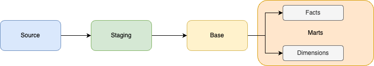
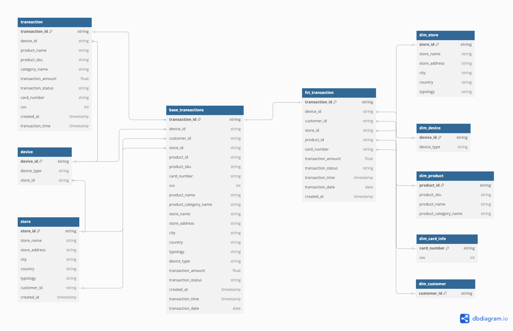

# test-store-analytics
Store analytics is a demo project in dbt to show how the data modeling should look like.

# Project Overview
In this project, we have multiple layers of data modeling, including
* Staging - One on One mapping with the source tables. Column renaming and type casting are done here.
* Base - This layer of transformation handles all the joins and union overall. Heavy transformations are done here.
* Marts- Marts is the golden layer for data consumption and reporting. All the questions answering queries are written 
in the analytics folder under marts.

# Data modeling
Here, the data modeling approach is dimensional modeling. As the data was in separate file containing different values
scalable approach is taken by combining all the sources into a giant table which will not be exposed to any user, 
thus only marts is the golden layer of this approach. The one big table is for putting everything together.
It's optimized using dbt's incremental strategies and indexing.

# ERD
Here is the lineage and ERD diagram of all the models

# Project Assumptions
Here the assumed transformation tool is dbt core and the data warehouse is Snowflake. 
The CSV files are not loaded as seed because the assumption is to use a data warehouse
Also connections are not stated here for now as the focus is on data modeling and writing query.
The SQL are written in native form as much possible. Some snowflake specific functions are being used to ease the operation.

